# Tema 2 - Creación de modelos de IA en Google Cloud con Vertex AI

---

## Introducción y Objetivos
Vertex AI es la plataforma de Google Cloud para la creación de modelos de inteligencia artificial (IA). Permite ejecutar todas las fases del ciclo de vida de un modelo: ingestón de datos, almacenamiento, transformación, entrenamiento, evaluación, interpretación y ajuste de hiperparámetros. Admite tanto enfoques código cero (AutoML) como desarrollo con herramientas de bajo nivel (Jupyter, BigQuery SQL).

Objetivos:
- Identificar herramientas de Vertex AI según la necesidad del proyecto.
- Ejecutar todas las fases de un modelo en Vertex AI.
- Aprovechar las ventajas cloud frente a infraestructura on-premise.

---

## Almacenamiento y Transformación de Datos

### Transferencia de datos a Google Cloud:
1. **Google Cloud Console**: Interfaz gráfica para subir archivos a buckets.
2. **GSUTIL** (CLI): `gsutil cp archivo.txt gs://mibucket`
3. **REST API**: Llamadas HTTP para gestión programática.
4. **BigQuery Data Transfer Service**: Transferencias programadas a BigQuery.
5. **Storage Transfer Service**: Para mover datos entre nubes y centros de datos.
6. **Transfer Appliance**: Dispositivo físico para grandes volúmenes de datos.

### Almacenamiento:
- **Google Cloud Storage (GCS)**: Datos no estructurados (imagen, audio, video).
- **BigQuery**: Datos estructurados; admite queries SQL y modelos ML.

### Transformación de datos:
- **Jupyter Notebooks**: Transformaciones manuales en Python.
- **Cloud Data Fusion**: Pipelines visuales sin programación.
- **Dataflow Pipelines**: Pipelines de Apache Beam (stream/batch).

---

## AI Workbench

### Jupyter Notebooks:
- Herramienta de exploración y prueba de modelos.
- Visualizaciones dinámicas, ejecución de celdas independiente.

### AI Workbench:
- Versión escalable y gestionada de notebooks en Google Cloud.
- Integración nativa con GCS y BigQuery.
- Dos tipos:
  - **Gestionado por usuario**: Alta personalización, uso de GPUs, configuración de red.
  - **Gestionado por Google**: Menor personalización, escalado automático.

### Contenedores Personalizados:
- Permiten usar entornos propios no soportados nativamente.
- Basados en Docker: se suben a Google Container Registry.

### Ejecución programada:
- Automatiza la ejecución de notebooks como tareas.
- Define recursos, frecuencia y parámetros desde la consola.

---

## AutoML en Vertex AI

### Notas

- **Lanzar el shell de Google**: Primero, se debe autorizar y obtener la shell.

  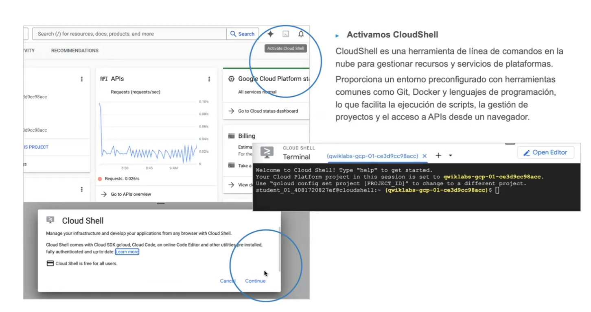

  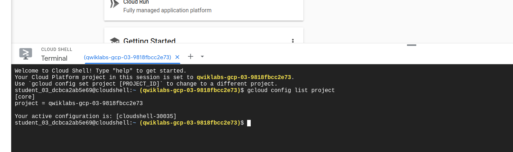

- **Creación de un bucket**: Los buckets son carpetas de almacenamiento para guardar datos usados en el entrenamiento.

  ```bash
  gcloud config list project
  export PROJECT_ID=$DEVSHELL_PROJECT_ID
  export BUCKET=$PROJECT_ID
  gsutil mb -p $PROJECT_ID -c standard -l "EU" gs://${BUCKET}
  ```

  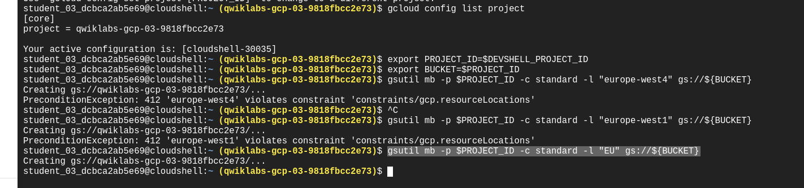

- **Copiar ficheros públicos de Google Cloud**:

  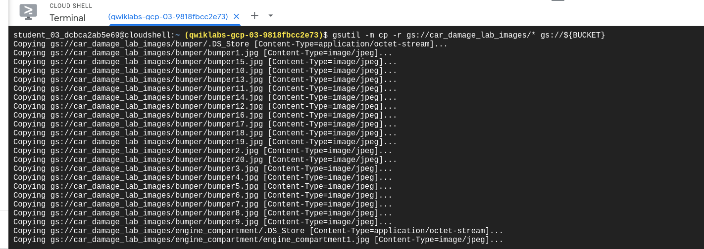

- **Verificar el bucket creado**:

  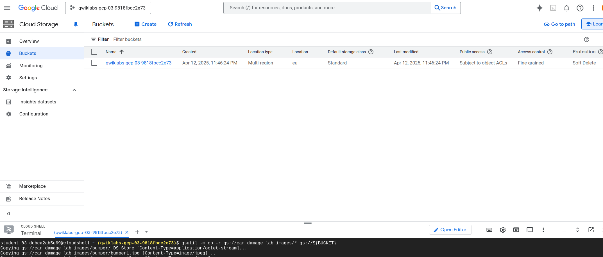

- **Subida manual de archivos**:

  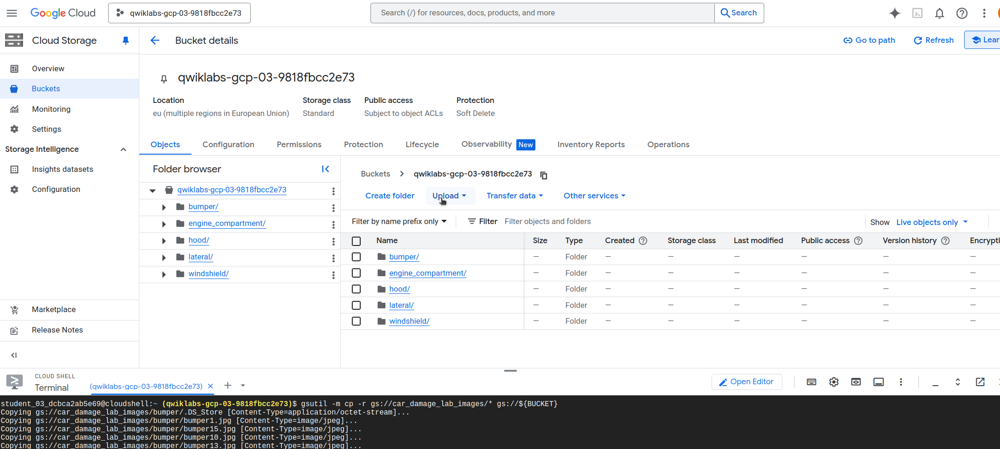

  Los archivos se almacenan como 'Standard', ideales para datos con acceso frecuente y baja latencia, como imágenes de una web.

- **Almacenamiento de datos en un CSV**:

  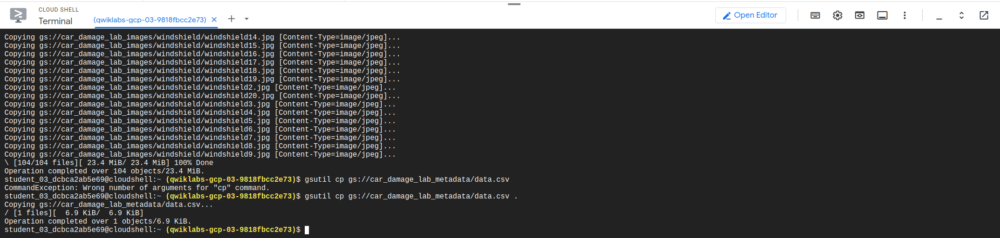

  Se sustituye el bucket original por el nuestro:

  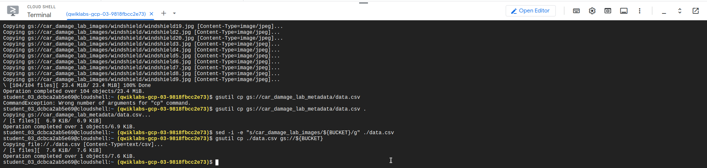

- **Creación de datasets**: En el apartado de datasets, se crea uno orientado a clasificación uniclase. El dataset debe estar en la misma región que el bucket.

  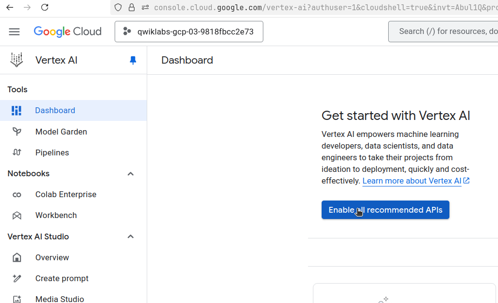

  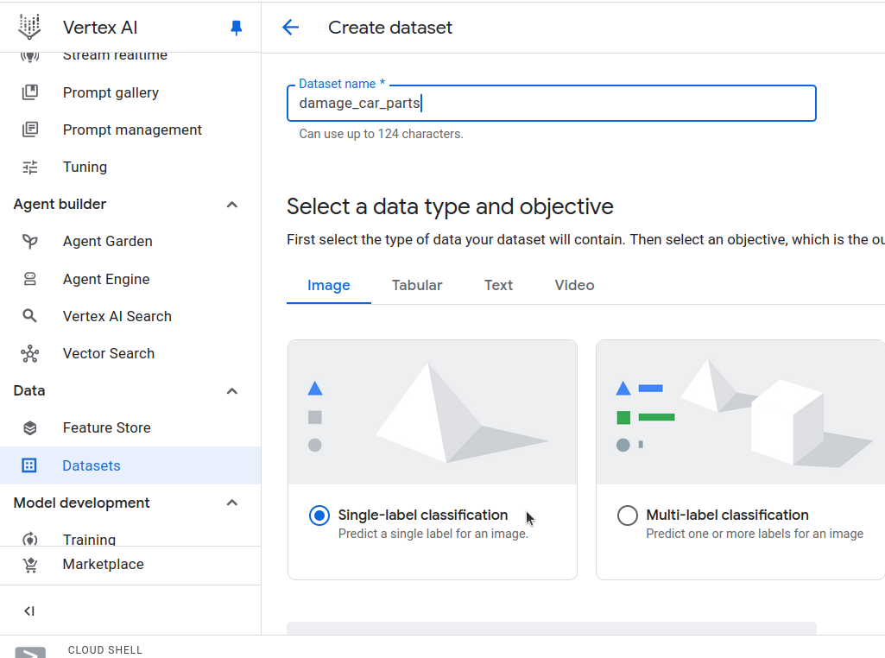

  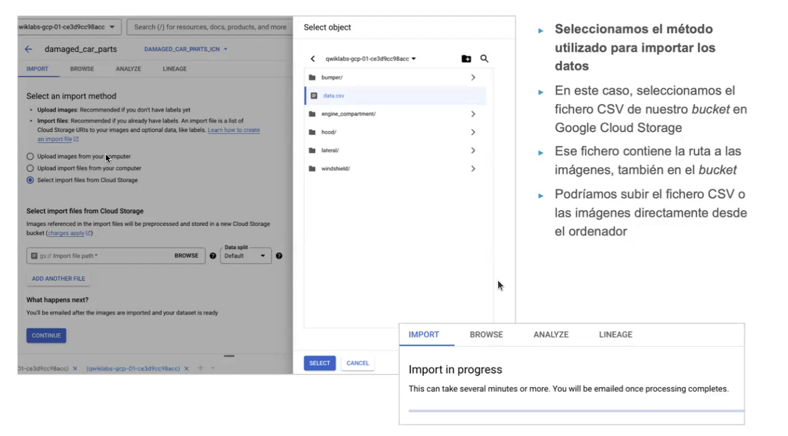

- **Entrenamiento del modelo**: Una vez importado y comprobado, se selecciona "train new model".

  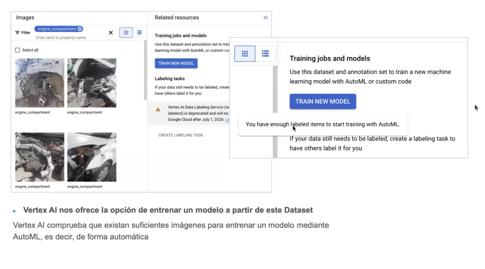

  Es posible entrenar un modelo o varias versiones del mismo, dentro del concepto de MLOps.

  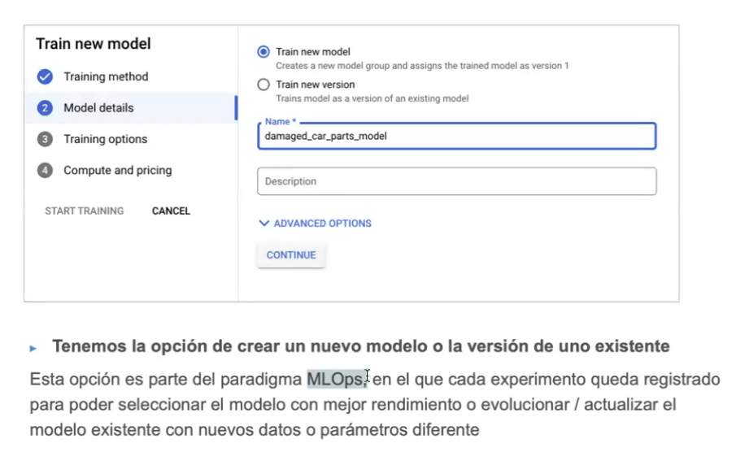

- **Entrenamiento incremental**: Permite entrenar solo con nuevos datos, sin mezclar con los anteriores, para perfeccionar el modelo.

  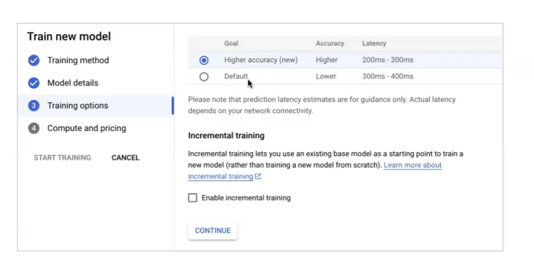

- **Asignación de presupuesto**: Se define en términos de horas de computación (máximo).

  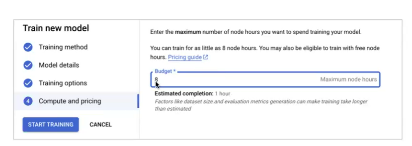

  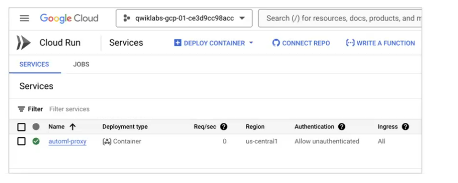

- **Predicciones**: Una vez entrenado el modelo, se realizan predicciones con Proxy-AutoML. Este recurso proporciona información analítica de las predicciones realizadas.

  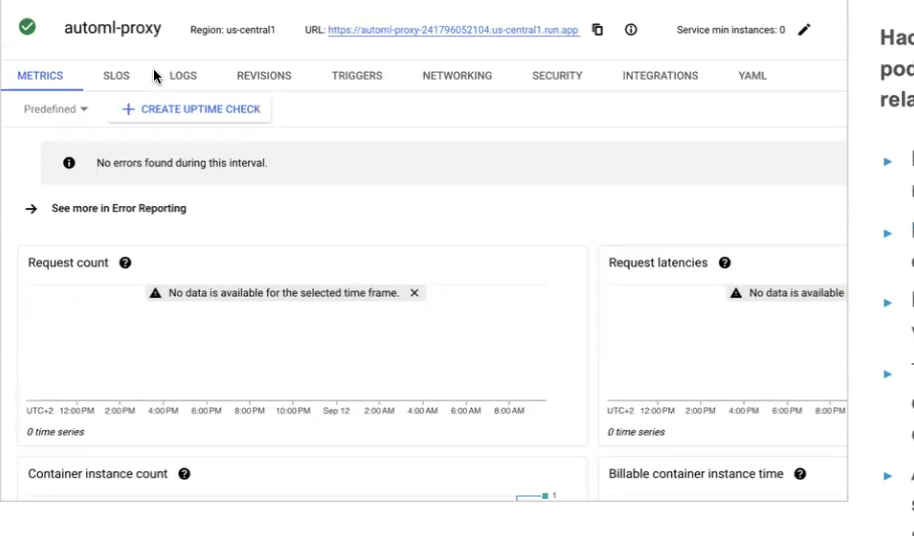

### Definición:
AutoML automatiza todas las etapas del modelado: limpieza, ingeniería de variables, selección de algoritmos, entrenamiento, evaluación y despliegue.

### Tipos soportados:
- Imagen (clasificación, detección, seguimiento).
- Texto (clasificación, análisis de sentimiento).
- Video.
- Tabular (regresión, clasificación, series temporales).

### Entrenamiento:
- Se importan datos en CSV.
- Se configuran objetivos, variables, métricas y tiempo de ejecución.
- Transformaciones automáticas por tipo:
  - Categóricas: index + embedding.
  - Texto: n-grams y embedding promedio.
  - Numéricas: z-score + log.
  - Temporales: extracción de componentes + z-score.

### Despliegue:
- Se puede hacer inferencia **batch** o en **endpoint online**.
- Configurable: tipo de VM, número de nodos, reparto de tráfico.

---

## BigQuery ML

> **Nota:**
> Construir modelos sin programar -> con SQL.
> Un entorno analítico, un Data Ware House moderno. A efectos prácticos un sistema para hacer consultas y sacar conclusiones.

### Creación de modelos con SQL:
- Modelos: regresión, clasificación, ARIMA, XGBoost, k-means, PCA...
- Ventajas: no requiere programación, trabaja con grandes volúmenes sin cargar en RAM.

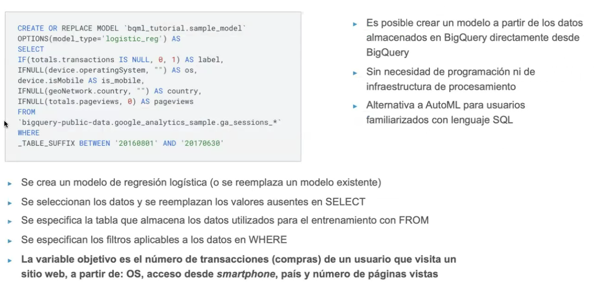

> **Nota:**
> Se empieza con CRETE OR REPLACE MODEL

### Transformación:
- Con `TRANSFORM` en `CREATE MODEL`.
- Soporta binning, n-grams, one-hot, normalización, imputación.

### Evaluación e Inferencia:
- `ML.EVALUATE()`
- `ML.PREDICT()`

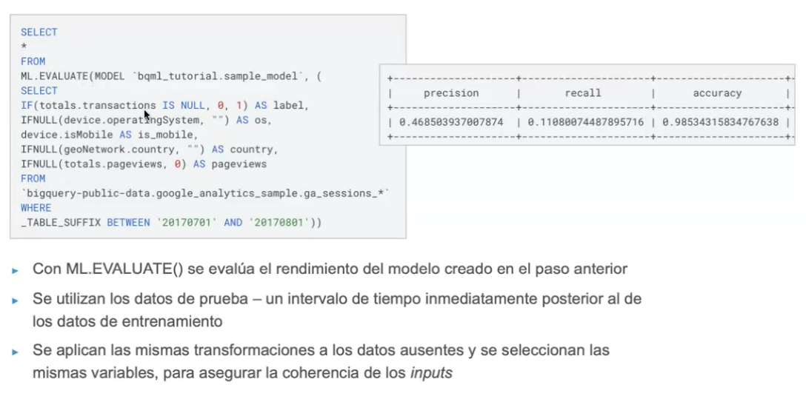

Resultado de inferencia:

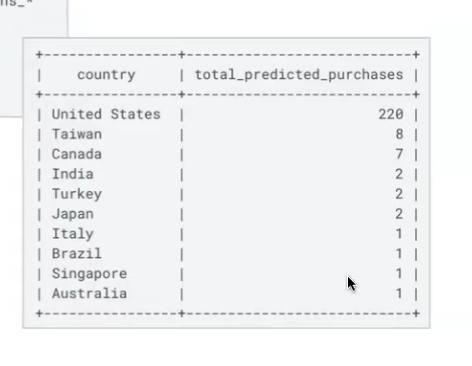

> **Nota:**
> El modelo muestra unas métricas

### Ajuste de hiperparámetros:
- Tipos: random search, grid search, Vizier.
- Métricas: accuracy, recall, f1, log_loss...

---

## Interpretación de modelos

### Explicabilidad:
- **Global**: influencia de variables en todo el modelo.
- **Local**: influencia en una predicción concreta.

### Técnicas:
- **SHAP**: modelos tabulares, AutoML o manuales.
- **Integrated Gradients / XRAI**: modelos de imagen.
- **Ejemplos similares**: compara predicciones entre inputs similares.

---

## Ajuste de Hiperparámetros

### Técnicas:
- **Grid search**: prueba exhaustiva (muy costoso).
- **Random search**: subconjuntos aleatorios.
- **Bayesian optimization**: aprendizaje progresivo.
- **Vertex AI**: incluye métodos avanzados como Gaussian Bandits.

### NAS (Neural Architecture Search):
- Diseño automático de arquitecturas de redes.
- Vertex AI provee lenguaje específico y recursos GPU.

---

## Cuaderno de ejercicios (resumen)
- Subida de archivos con `gsutil -m cp`.
- Entrenamiento con SQL (`CREATE MODEL`).
- Definición de hiperparámetros (`parameter_spec`).
- Cómputo de matriz de confusión con `ML.CONFUSION_MATRIX()`.

---

## Referencias y enlaces
- Google Cloud Docs (AutoML, BigQuery ML, Workbench)
- O'Reilly: *Hands-On Machine Learning on GCP*
- Medium: Artículos técnicos sobre Vertex AI
- Panopto: vídeos prácticos de la UNIR

---

Este resumen cubre todo el contenido del Tema 2 en profundidad. Si deseas que lo convierta en una presentación, mapa mental o ejemplos con código real... ¡te lo armo encantado!
